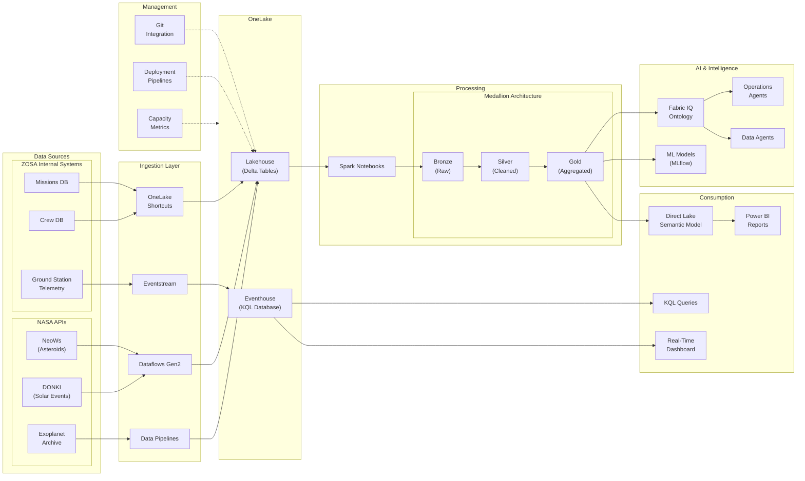
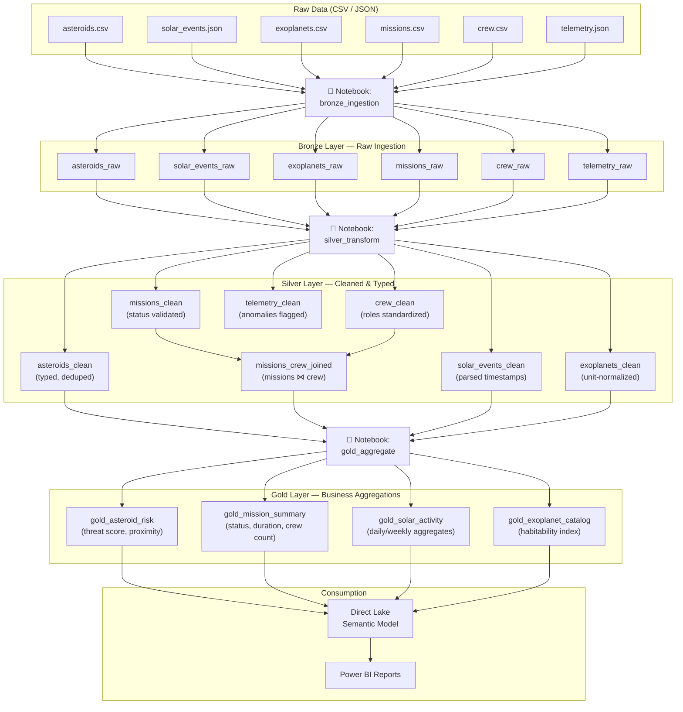
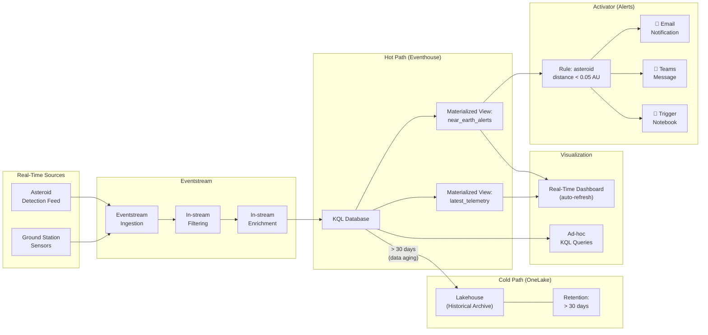
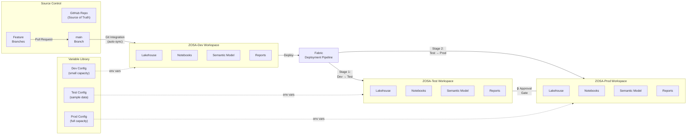

# ZOSA Platform — Architecture Diagrams

Reference diagrams for the Zenith Orbital Space Agency analytics platform built on Microsoft Fabric.
These are referenced from individual lab modules.

---

## 1. Overall ZOSA Architecture

High-level view of the complete analytics platform: data sources, ingestion, storage, processing, consumption, AI, and management layers.

---

## 2. Medallion Lakehouse Flow

Detailed view of the Bronze → Silver → Gold pipeline showing tables, transformations, and downstream consumption.

---

## 3. Real-Time Intelligence Pipeline

Real-time data flow from ground station sensors through Eventstream, Eventhouse, dashboards, and alerting.

---

## 4. CI/CD Deployment Flow

Git-integrated deployment pipeline from source control through Dev, Test, and Production workspaces.

