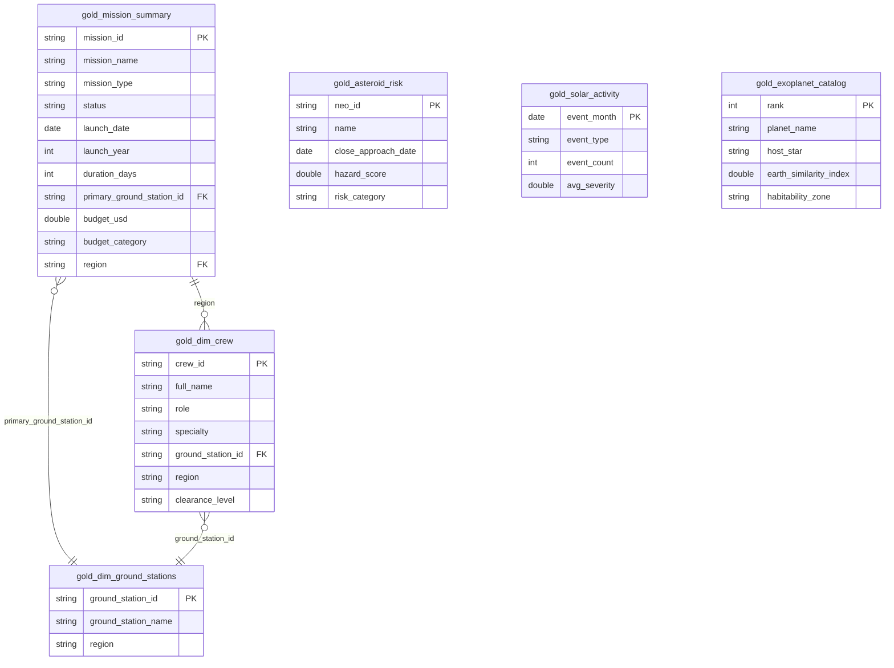

# Module 05 — Semantic Model (Direct Lake)

> **Story time 🛰️:** The science directors burst into the data-engineering bullpen at 08:00 sharp.
> *"We need dashboards — yesterday."* You lean back in your chair and smile.
> *"Direct Lake gives us blazing-fast queries without importing a single byte of data."*
> The directors exchange puzzled glances. Time to show them what Fabric can really do.

---

## 🔍 1 — What Is Direct Lake?

Direct Lake is Microsoft Fabric's **third query mode** — and it combines the best parts of Import and DirectQuery while dodging their biggest trade-offs.

| Capability | Import | DirectQuery | **Direct Lake** |
|---|---|---|---|
| Query speed | ⚡ Fast (in-memory) | 🐢 Depends on source | ⚡ Fast (columnar read from Delta) |
| Data freshness | ⏰ Stale until refresh | ✅ Real-time | ✅ Near-real-time (auto-sync) |
| Data duplication | ❌ Full copy in model | ✅ No copy | ✅ No copy — reads parquet directly |
| Works with Delta tables | ❌ Needs import | ✅ Via SQL endpoint | ✅ Native OneLake access |
| Memory footprint | 🔴 High | 🟢 Low | 🟢 Low (on-demand columnar cache) |

> 💡 **How it works under the hood:** Direct Lake memory-maps the Delta/Parquet files in OneLake and loads column segments on demand — no ETL, no scheduled refresh, no V-Order shuffle. When you add new data to the Gold layer, the model picks it up automatically.

> ⚠️ **Important:** Direct Lake requires your data to live in a Fabric Lakehouse or Warehouse. External Delta tables (e.g., on ADLS Gen2 via shortcut) work only if a OneLake shortcut is configured first.

> 📚 **Official Documentation:**
> - [Direct Lake Overview](https://learn.microsoft.com/en-us/power-bi/enterprise/directlake-overview)
> - [Direct Lake vs Import vs DirectQuery](https://learn.microsoft.com/en-us/power-bi/connect-data/service-dataset-modes-understand)

---

## 🧠 Why a Semantic Model? (Why Not Just Query Gold Tables Directly?)

Your Gold tables are clean, aggregated, and ready for analysis. So why add another layer?

A **semantic model** is a business-friendly abstraction on top of your data. Think of it as the **contract between data engineers and report consumers**. It provides:

| Benefit | Without Semantic Model | With Semantic Model |
|---------|----------------------|---------------------|
| **Business logic** | Every report re-implements measures (risk scoring, success rates) | Define once, reuse everywhere via DAX measures |
| **Relationships** | Consumers must know how to JOIN tables | Star schema auto-resolves cross-table filters |
| **Security** | RLS/OLS requires custom SQL views per user | RLS/OLS enforced automatically for all consumers |
| **Performance** | Each report sends ad-hoc queries | Columnar engine optimizes all queries centrally |
| **Governance** | Multiple "sources of truth" proliferate | One certified model = single source of truth |
| **Self-service** | Analysts need SQL skills | Drag-and-drop fields in Power BI, Excel, or Copilot |

**In short:** Gold tables are optimized for *storage*. The semantic model is optimized for *consumption*. It turns your well-engineered data into something that business users, dashboards, AI agents, and even natural-language queries (via Copilot) can all use — without needing to understand Delta tables, Spark, or SQL.

> 💡 **Real-world analogy:** Gold tables are the library's organized shelves. The semantic model is the card catalog — it helps people *find and use* what's on those shelves without needing to know the Dewey Decimal System.

---

## 🏗️ 2 — Create the Semantic Model

You will now build the **ZOSA Analytics Model** on top of the Gold tables you created in Module 04.

### Steps

1. Open your **lh_zosa** in the Fabric portal.
2. In the Lakehouse ribbon, click **New Power BI semantic model**.
3. Name the model: `ZOSA Analytics Model`.
4. In the table picker, select the **Gold layer** tables:
   - `gold_asteroid_risk`
   - `gold_mission_summary`
   - `gold_solar_activity`
   - `gold_exoplanet_catalog`
   - `gold_dim_crew`
   - `gold_dim_ground_stations`
5. Click **Confirm**. Fabric creates a Direct Lake semantic model and opens the **Model view** in **Viewing mode**. Click **Editing** in the toolbar to switch to **Editing mode** before making changes.

> 💡 **Tip:** If you don't see the Gold tables, make sure the notebooks from Module 04 ran successfully and that the tables are registered in the Lakehouse explorer.

> 📚 **Learn more:** [Create Semantic Models in Fabric](https://learn.microsoft.com/en-us/fabric/data-warehouse/semantic-models)

---

## 🔗 3 — Define Relationships (Star Schema)

A clean star schema means faster queries and simpler DAX. Your **fact table** is `gold_mission_summary` (one row per mission); the other tables serve as dimensions or independent fact tables.

### Steps

1. In the **Model view**, you should already see the diagram layout with all tables displayed.

   > 💡 **Note:** If the model opened in **Viewing mode**, click **Editing** in the toolbar to switch to **Editing mode** before making changes.

2. Create the following relationships by dragging columns between tables:

| From (Table) | Column | To (Table) | Column | Cardinality | Cross-filter |
|---|---|---|---|---|---|
| `gold_mission_summary` | `region` | `gold_dim_crew` | `region` | One-to-many | Single |
| `gold_mission_summary` | `primary_ground_station_id` | `gold_dim_ground_stations` | `ground_station_id` | Many-to-one | Single |
| `gold_dim_crew` | `ground_station_id` | `gold_dim_ground_stations` | `ground_station_id` | Many-to-one | Single |

3. After wiring the relationships, your diagram should show a star with `gold_mission_summary` as the fact table at the center, connected to `gold_dim_crew` and `gold_dim_ground_stations` as dimensions. The remaining Gold tables (`gold_asteroid_risk`, `gold_solar_activity`, `gold_exoplanet_catalog`) are independent fact tables — they answer separate business questions and will be used on their own report pages.



> 💡 **Tip:** If Fabric auto-detected relationships, review them carefully. Auto-detection sometimes creates incorrect cardinalities — always validate manually.

> 📚 **Official Documentation:**
> - [Star Schema Design Guidance](https://learn.microsoft.com/en-us/power-bi/guidance/star-schema)
> - [Understand Model Relationships](https://learn.microsoft.com/en-us/power-bi/transform-model/desktop-relationships-understand)

---

## 📐 4 — Create DAX Measures

Measures are reusable calculations that evaluate at query time. You'll add them to `gold_mission_summary` so they're easily accessible in reports.

### How to add a measure

1. In the **Data** pane (left side), expand **Tables** → expand `gold_mission_summary`.
2. Right-click **Measures (0)** → select **New measure** (or select the table and click **New measure** in the ribbon).
3. A **formula bar** appears at the top of the editor — paste the DAX expression.
4. Press **Enter** or click the ✓ checkmark to save.
5. Repeat for each measure below.

> 💡 **Note:** Fabric places each measure in the table it references. Below, measures are grouped by table so you know which table to select before clicking **New measure**.

---

### Measures on `gold_asteroid_risk`

Select **gold_asteroid_risk** in the Data pane, then create each measure:

**4.1 — Active Missions**

```dax
Active Missions =
    CALCULATE(
        COUNTROWS(gold_mission_summary),
        gold_mission_summary[status] = "Active"
    )
```

**4.2 — Max Hazard Score**

```dax
Max Hazard Score =
    MAX(gold_asteroid_risk[hazard_score])
```

**4.3 — Near-Earth Objects**

```dax
Near-Earth Objects =
    COUNTROWS(gold_asteroid_risk)
```

**4.4 — Total Budget**

```dax
Total Budget =
    SUM(gold_mission_summary[budget_usd])
```

---

### Measures on `gold_mission_summary`

Select **gold_mission_summary** in the Data pane, then create each measure:

**4.5 — Critical Asteroids**

```dax
Critical Asteroids =
    CALCULATE(
        COUNTROWS(gold_asteroid_risk),
        gold_asteroid_risk[risk_category] = "Critical"
    )
```

**4.6 — Habitable Candidates**

```dax
Habitable Candidates =
    CALCULATE(
        COUNTROWS(gold_exoplanet_catalog),
        gold_exoplanet_catalog[habitability_zone] = "Habitable Zone"
    )
```

**4.7 — Hazard Index**

```dax
Hazard Index =
    AVERAGE(gold_asteroid_risk[hazard_score])
```

> This gives mission control a single number summarizing the current asteroid threat level.

**4.8 — Mission Success Rate**

```dax
Mission Success Rate =
    DIVIDE(
        CALCULATE(
            COUNTROWS(gold_mission_summary),
            gold_mission_summary[status] = "Completed"
        ),
        COUNTROWS(gold_mission_summary)
    )
```

> 💡 **Why `DIVIDE` instead of `/`?** `DIVIDE` handles division-by-zero gracefully — returning `BLANK()` instead of an error.

**4.9 — Total Missions**

```dax
Total Missions =
    COUNTROWS(gold_mission_summary)
```

---

### Validation

After creating all nine measures you should see in the Data pane:
- **gold_asteroid_risk** → Measures (4): Active Missions, Max Hazard Score, Near-Earth Objects, Total Budget
- **gold_mission_summary** → Measures (5): Critical Asteroids, Habitable Candidates, Hazard Index, Mission Success Rate, Total Missions

To verify measures return correct values:

1. Go back to the semantic model item page (click the model name in the breadcrumb).
2. Click **"Explore this data"** (top ribbon) — this opens a lightweight report canvas.
3. From the **Data** pane on the right, drag each measure onto the canvas — it will display as a card with the computed value.
4. Confirm values are not blank or showing errors.

> ⚠️ The **Model view** only lets you define measures — it doesn't show computed results. You must use "Explore this data" or create a report to see actual values.

> 📚 **Learn more:** [DAX Reference](https://learn.microsoft.com/en-us/dax/dax-overview)

---

## 🔒 5 — Implement Row-Level Security (RLS)

Row-Level Security restricts which rows a user can see based on their identity. ZOSA's European analysts should see only missions from their region.

### Create the Role

1. In the semantic model editor (Model view), click **Manage roles** in the ribbon (under Security).
2. Click **+ New** to create a role and name it: `Europe_Analysts`.
3. In the **Tables** list, select `gold_mission_summary`.
4. In the **Rules** panel, set:
   - **Column:** `region`
   - **Condition:** `Equals`
   - **Value:** `Europe`
5. Click **Save**.

### Assign Members

1. Go back to the **workspace** (click workspace name in breadcrumb).
2. Find the semantic model → click the **ellipsis (...)** → **Security**.
3. Select `Europe_Analysts` on the left.
4. Add a test user email (or your own) → click **Add** → **Save**.

### Test the Role

To test RLS, you need a **report** connected to the semantic model:

1. From the workspace, find the semantic model → click **ellipsis (...)** → **Create report** (or open an existing report built on this model).
2. Add a simple **Table visual** with columns from `gold_mission_summary` (e.g., `mission_name`, `region`, `status`).
3. **Save** the report (give it any name, e.g., "RLS Test").
4. In the report **Reading view**, click the **ellipsis (...)** in the top toolbar → select **"View as roles"**.
5. Check the box for **Europe_Analysts** → click **OK**.
6. Verify the table only shows rows where `region = "Europe"`.
7. A yellow banner at the top confirms: *"Now viewing report as: Europe_Analysts"*.
8. Click **"Stop viewing"** when done.

> ⚠️ **The "View as roles" option only appears in report Reading view** — it is not available in the Model editor or Explore data view.

> 💡 **Recall:** In Module 02, you configured **OneLake Security** at the storage layer. RLS operates at the **semantic model** layer — a complementary defense. OneLake Security controls who can *access* the files; RLS controls who can *see which rows* once they have access.

> ⚠️ **Important:** RLS only applies when users query through the semantic model (e.g., Power BI reports). Direct Lakehouse SQL queries bypass RLS entirely — OneLake Security is your backstop there.

> 📚 **Learn more:** [Row-Level Security in Semantic Models](https://learn.microsoft.com/en-us/fabric/security/service-admin-row-level-security)

---

## 🛡️ 6 — Configure Object-Level Security (OLS)

Object-Level Security hides entire columns or tables from specific roles. ZOSA's `budget_usd` column in `gold_mission_summary` should be visible only to executives.

### Steps (via Tabular Editor)

1. **Connect Tabular Editor to your model:**
   - Open **Tabular Editor** (download from [tabulareditor.com](https://tabulareditor.com) if needed).
   - Connect using the **XMLA endpoint** of your Fabric workspace. Find it under **Workspace settings → Premium → Workspace connection**.
   - Select `ZOSA Analytics Model`.

2. **Create an OLS role:**
   - In the **Roles** node, create a new role called `Non_Executive`.
   - Under **Table Permissions**, set `gold_mission_summary` to **Read**.

3. **Hide the column:**
   - Expand `gold_mission_summary` → `Columns` → right-click `budget_usd`.
   - Under **Object-Level Security**, set the `Non_Executive` role to **None** (no access).

4. **Save and deploy** back to the Fabric service.

> 💡 **XMLA Endpoint Access:** The XMLA read/write endpoint is available in Fabric capacities (F SKUs). Make sure your workspace is assigned to a capacity and that XMLA read/write is enabled in the **Admin portal → Capacity settings**.

> ⚠️ **Important:** OLS is configured through external tools (Tabular Editor, SSMS) because the Fabric portal does not yet have a native OLS editor. Always test OLS changes in a development workspace before promoting to production.

> 📚 **Official Documentation:**
> - [XMLA Endpoint Connectivity](https://learn.microsoft.com/en-us/power-bi/enterprise/service-premium-connect-tools)
> - [External Tools (Tabular Editor)](https://learn.microsoft.com/en-us/power-bi/transform-model/desktop-external-tools)

---

## ✅ 7 — Checkpoint

Before moving on, verify that everything is in place:

- [ ] **Semantic model** `ZOSA Analytics Model` exists in your workspace and uses **Direct Lake** mode.
- [ ] **Six tables** are loaded: four Gold fact tables + two Gold dimensions.
- [ ] **Relationships** form a star schema centered on `gold_mission_summary`.
- [ ] **Nine DAX measures** return valid values:
  - `Hazard Index` — a decimal number
  - `Mission Success Rate` — a percentage (0–1 range)
  - `Critical Asteroids` — an integer count
  - `Habitable Candidates` — an integer count
  - `Total Missions` — an integer count
  - `Active Missions` — an integer count
  - `Total Budget` — a currency value
  - `Max Hazard Score` — a decimal number
  - `Near-Earth Objects` — an integer count
- [ ] **RLS role** `Europe_Analysts` filters correctly (verified with "View as").
- [ ] **OLS** hides `budget_usd` for `Non_Executive` role (verified in Tabular Editor).

> 🎉 **Congratulations!** Your semantic model is ready. The science directors won't need to wait until tomorrow — they can start exploring data *right now*. But raw numbers aren't enough; they want beautiful, interactive visuals. That's exactly what you'll build in Module 06.

---

**Navigation:**
[← Module 04 — Medallion Lakehouse](04-medallion-lakehouse.md) | [Module 06 — Power BI Reports →](06-power-bi-reports.md)

[← Back to README](../README.md)
