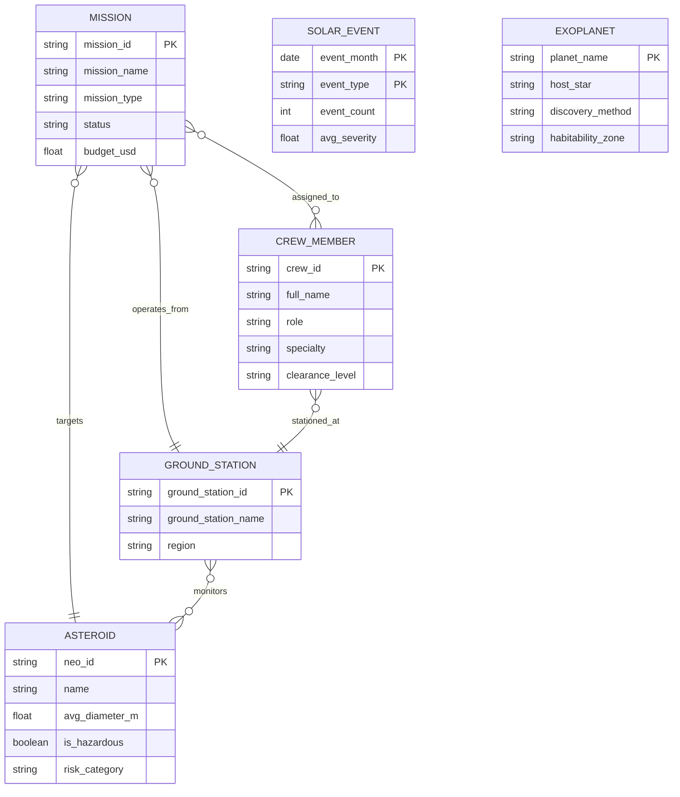

# Module 10 — Ontology & Knowledge Graph

> One language for the whole agency — Fabric IQ Ontology

> ⚠️ **Public Preview Notice:** Fabric IQ and Ontology are in **Public Preview** as of April 2026. Features, APIs, and UI may change before General Availability. Use in production at your own discretion.

---

## 📖 The Story So Far

> During the weekly standup, the Science team refers to *"celestial targets,"* Mission Ops calls them *"threat objects,"* and the Defense team says *"NEOs."* Dr. Vasquez slams her coffee mug on the table:
>
> *"We need ONE language. Every team, every dashboard, every AI agent — same definitions. Build me an ontology."*

You've built every data layer — Bronze through Gold — stood up reports, real-time dashboards, and machine-learning models. But terminology chaos still slows the agency down. Today you'll fix that by creating a **Fabric IQ Ontology** that gives ZOSA a single, governed vocabulary.

---

## 1️⃣ What Is Fabric IQ?

**Fabric IQ** is the semantic intelligence layer for Microsoft Fabric, first announced at **Ignite 2025**. It provides a shared vocabulary for **humans AND AI agents** by mapping plain-language business concepts to live data assets.

| Concept | What It Does |
|---|---|
| **Ontology** | A container that holds entity types, relationships, and business terms — all linked to your Delta tables. |
| **Entity Type** | A first-class business object (e.g., *Asteroid*, *Mission*, *Crew Member*). |
| **Business Term / Synonym** | Aliases that ensure "NEO," "threat object," and "celestial target" all resolve to the same entity. |
| **Derived Property** | A derived column defined once in the ontology and available everywhere — dashboards, notebooks, AI agents. |

> 💡 **Why it matters:** Without an ontology, every team writes its own filters, every AI agent hallucinates its own joins, and every report defines "hazardous" differently. The ontology is the **single source of truth** for meaning.

> 📚 **Official Documentation:**
> - [Fabric IQ Ontology Overview](https://learn.microsoft.com/en-us/fabric/iq/ontology/overview)
> - [Create Entity Types](https://learn.microsoft.com/en-us/fabric/iq/ontology/how-to-create-entity-types)
> - [Fabric Copilot Overview](https://learn.microsoft.com/en-us/fabric/get-started/copilot-fabric-overview)

> ⚠️ **Preview Reminder:** Fabric IQ Ontology is in **Public Preview**. The steps below reflect the current UI — expect minor changes as the feature evolves toward GA.

---

## 2️⃣ Design the ZOSA Ontology

Before you touch Fabric, grab a whiteboard (or a Mermaid diagram). Good ontology design happens on paper first.

### Entity Types

| Entity | Key Properties | Source Table |
|---|---|---|
| **Asteroid** | `neo_id`, `name`, `avg_diameter_m`, `is_hazardous`, `risk_category` | `gold_asteroid_risk` |
| **Mission** | `mission_id`, `mission_name`, `mission_type`, `status`, `budget_usd` | `gold_mission_summary` |
| **Crew Member** | `crew_id`, `full_name`, `role`, `specialty`, `clearance_level` | `gold_dim_crew` |
| **Ground Station** | `ground_station_id`, `ground_station_name`, `region` | `gold_dim_ground_stations` |
| **Solar Event** | `event_month`, `event_type`, `event_count`, `avg_severity` | `gold_solar_activity` |
| **Exoplanet** | `planet_name`, `host_star`, `discovery_method`, `habitability_zone` | `gold_exoplanet_catalog` |

### Relationships

| From | Relationship | To | Cardinality |
|---|---|---|---|
| Mission | **targets** | Asteroid | Many-to-One |
| Mission | **assigned_to** | Crew Member | Many-to-Many |
| Mission | **operates_from** | Ground Station | Many-to-One |
| Ground Station | **monitors** | Asteroid | Many-to-Many |
| Crew Member | **stationed_at** | Ground Station | Many-to-One |

### Entity-Relationship Diagram



> 💡 **Tip:** Print this diagram and tape it to the wall. Every data engineer, analyst, and AI builder should reference the same picture.

---

## 3️⃣ Create an Ontology

Now translate the whiteboard design into Fabric.

1. Open the **ZOSA-Dev** workspace in the Fabric portal.
2. Click **+ New Item** → search for **"Ontology"** → select **Ontology (preview)**.
3. Name the ontology: **`zosa_knowledge_model`**.
4. Add an optional description: *"Unified ontology for ZOSA asteroid-defense operations."*
5. Choose the creation method:
   - **Generate from semantic model** — if your Gold layer already feeds a Power BI semantic model with trusted measures and dimensions, start here to accelerate ontology mapping.
   - **Build from OneLake** — if you want to map directly to Delta tables in your Lakehouse.
6. Click **Create**. Fabric opens the ontology designer canvas.

> ⚠️ **Preview Note:** If you don't see *Ontology (preview)* under **+ New Item**, ensure your tenant admin has enabled the **Fabric IQ (Preview)** feature in the admin portal under *Tenant settings → Fabric IQ*. You may also need to enable **Microsoft Copilot and Azure OpenAI** tenant settings.

> 💡 **Pro Tip:** If your Gold layer already feeds a **Power BI semantic model**, choose "Generate from semantic model" — it already contains trusted measures and dimension hierarchies that accelerate ontology mapping.

---

## 4️⃣ Map Entities to Gold Tables

For each entity type in your design, connect it to the underlying Delta table.

### Steps (repeat for each entity)

1. In the ontology designer, click **+ Add Entity Type**.
2. Name it (e.g., `Asteroid`).
3. Under the **Bindings** tab, bind the entity to your data:
   - Select the Lakehouse → **Tables** → choose the corresponding Gold table (e.g., `gold_asteroid_risk`).
4. **Map columns to entity properties:**
   - Click **Add entity type key** to designate the key field (e.g., `neo_id`) ✅
   - `name` → Display Name ✅
   - Map remaining columns: `avg_diameter_m`, `is_hazardous`, `risk_category`.
5. After mapping all entities, **Save** the ontology (changes are saved at the ontology level, not per entity).
6. Click **Refresh the graph model** to sync data bindings with the underlying tables.

Repeat for all six entity types:

| Entity | Delta Table | Entity Type Key | Display Name |
|---|---|---|---|
| Asteroid | `gold_asteroid_risk` | `neo_id` | `name` |
| Mission | `gold_mission_summary` | `mission_id` | `mission_name` |
| Crew Member | `gold_dim_crew` | `crew_id` | `full_name` |
| Ground Station | `gold_dim_ground_stations` | `ground_station_id` | `ground_station_name` |
| Solar Event | `gold_solar_activity` | `event_month` + `event_type` | `event_type` |
| Exoplanet | `gold_exoplanet_catalog` | `planet_name` | `planet_name` |

> 💡 **Tip:** Set friendly property names (e.g., rename `is_hazardous` to `Is Hazardous`). AI agents and search will use these names in natural-language answers.

---

## 5️⃣ Define Business Terms & Synonyms

This is the step that ends the vocabulary wars. For each concept that different teams name differently, create aliases so the ontology resolves them.

> ⚠️ **Preview Limitation:** Dedicated synonym fields are not yet a first-class UI feature in the current preview. Use the **description field** on each entity type to document common aliases. As the ontology matures toward GA, expect native synonym support to be added.

### Key Terms to Document

| Canonical Term | Aliases (add to description field) |
|---|---|
| **Asteroid** | Near-Earth Object, NEO, Target Object, Threat, Celestial Target |
| **Hazard Score** | Risk Index, Threat Level, Danger Rating |
| **Ground Station** | Observatory, Tracking Station, Monitoring Facility |
| **Mission** | Operation, Campaign, Deployment |
| **Crew Member** | Operator, Astronaut, Personnel |

### Steps

1. Select an entity type (e.g., `Asteroid`).
2. Open the entity's **description** or **metadata** section.
3. Add common aliases — e.g., *"Also known as: Near-Earth Object, NEO, Threat Object, Celestial Target."*
4. Repeat for property-level terms (e.g., `risk_category` description: *"Also called: Hazard Score, Threat Level, Danger Rating."*).
5. **Save** the ontology after updating descriptions.

> 🎯 **Why this matters:** When an analyst types *"show me all NEOs near Earth"* into a Fabric search bar or an AI agent prompt, the ontology resolves **NEO → Asteroid** automatically. No more guesswork, no more mismatched filters.

> 📚 **Official Documentation:**
> - [Business Glossary / Purview](https://learn.microsoft.com/en-us/purview/concept-business-glossary)
> - [Metadata Scanning](https://learn.microsoft.com/en-us/fabric/admin/metadata-scanning-overview)

---

## 6️⃣ Add Derived Properties

Derived properties are calculated values defined once in the ontology and usable everywhere — reports, notebooks, Copilot answers.

### Properties to Define

| Entity | Derived Property | Logic |
|---|---|---|
| **Asteroid** | `threat_level` | Derived from `relative_velocity_kph`, `avg_diameter_m`, and `miss_distance_km`. Example: `CASE WHEN relative_velocity_kph > 72000 AND avg_diameter_m > 500 AND miss_distance_km < 7500000 THEN 'Critical' WHEN is_hazardous = true THEN 'High' ELSE 'Normal' END` |
| **Mission** | `is_long_duration` | `CASE WHEN duration_days > 365 THEN true ELSE false END` |
| **Exoplanet** | `is_earth_like` | `CASE WHEN earth_similarity_index > 0.8 AND habitability_zone = 'Habitable Zone' THEN true ELSE false END` |

### Steps

1. Select the entity (e.g., `Asteroid`).
2. Click **+ Add Property**.
3. Enter the property name: `threat_level`.
4. Write the expression using the ontology expression editor.
5. Set the return type (`String` for threat_level, `Boolean` for is_long_duration and is_earth_like).
6. **Save** the ontology.

> ⚠️ **Preview Limitation:** Expression support is limited in preview. Complex expressions may need to be pre-computed in your Gold layer notebook and exposed as regular mapped properties instead.

---

## 7️⃣ Test the Ontology

Before handing the ontology to the rest of the agency, verify it works as expected.

### Browse Entities

1. In the ontology designer, open the **Preview experience** to launch the graph visualization.
2. Select **Asteroid** — you should see a paginated list of all asteroid entities with their properties.
3. Click any asteroid to view its **detail card**: properties, relationships, and derived values.

### Search

1. Use the ontology **Search** bar.
2. Type: *"dangerous asteroids near Earth"*
3. Verify the search resolves the synonym "dangerous" to `is_hazardous = true` and returns the correct filtered list.

### Traverse Relationships

1. From an asteroid detail card, click the **Relationships** tab.
2. Verify you can navigate: Asteroid → targeted by → Mission → assigned to → Crew Members.
3. Confirm the relationship chain resolves correctly across all entity types.

### Validate Derived Properties

1. Open the **Asteroid** entity list.
2. Confirm the `threat_level` column shows derived values (Critical / High / Normal).
3. Spot-check a few records against the Gold table to ensure the logic is correct.

> ✅ If all of the above works, your ontology is ready for production use.

---

## 8️⃣ Ontology Governance

An ontology is only as good as its governance. Establish clear ownership and change-management processes.

### Ownership Model

| Role | Responsibility |
|---|---|
| **Ontology Owner** (Data Architect) | Approves new entity types and relationship changes |
| **Domain Steward** (per team) | Maintains synonyms and business terms for their domain |
| **Data Engineer** | Ensures Gold tables stay aligned with entity mappings |
| **AI/Agent Builder** | Consumes the ontology; reports gaps or missing terms |

### Change Management Process

1. **Propose** — Submit a change request (new entity, synonym, or relationship) via your team's governance channel.
2. **Review** — The Ontology Owner and affected Domain Stewards review the proposal.
3. **Approve & Implement** — Changes are made in the ontology.
4. **Validate** — Run the test steps from Section 7 to confirm nothing breaks.
5. **Publish** — The updated ontology is available to all consumers.

### Version History

Fabric IQ Ontology maintains a **version history**. Use it to:

- Track who changed what and when.
- Roll back if a synonym causes unintended query behavior.
- Audit changes for compliance.

### Integration with External Agents (MCP)

> ⚠️ **Preview Feature:** MCP (Model Context Protocol) integration is part of the Fabric IQ public preview.

Fabric IQ ontologies can be exposed to **third-party AI agents** via MCP endpoints. This means external tools and custom agents can query your ontology for entity definitions, relationships, and business terms — ensuring consistent language even outside the Fabric ecosystem.

The MCP server endpoint follows this format:
```
https://api.fabric.microsoft.com/v1/mcp/dataPlane/workspaces/<workspace-ID>/items/<ontology-item-ID>/ontologyEndpoint
```

To connect an MCP-compatible client (VS Code Agent Mode, Claude Desktop, etc.), register this endpoint URL with OAuth 2.1 authentication.

> 💡 **Future-Proofing:** As MCP support matures, your ontology becomes the **universal contract** between ZOSA's internal dashboards and external partner systems.

> 📚 **Official Documentation:**
> - [Use Ontology MCP Server](https://learn.microsoft.com/en-us/fabric/iq/ontology/how-to-use-ontology-mcp-server)
> - [Lineage](https://learn.microsoft.com/en-us/fabric/governance/lineage)
> - [Impact Analysis](https://learn.microsoft.com/en-us/fabric/governance/impact-analysis)

---

## ✅ Module 10 Checkpoint

Verify you've completed each milestone before proceeding:

- [ ] Ontology **`zosa_knowledge_model`** created in the ZOSA-Dev workspace
- [ ] **6 entity types** (Asteroid, Mission, Crew Member, Ground Station, Solar Event, Exoplanet) mapped to Gold Delta tables
- [ ] **5 relationships** defined and resolvable (targets, assigned_to, operates_from, monitors, stationed_at)
- [ ] **Business terms and synonyms** documented for at least 5 canonical terms
- [ ] **3 derived properties** defined (threat_level, is_long_duration, is_earth_like)
- [ ] **Ontology browsing and search** returns expected results
- [ ] **Governance roles** and change-management process documented

---

## 📖 Closing Story

> Dr. Vasquez reviews the ontology diagram projected on the main screen. She nods slowly.
>
> *"Now everyone speaks the same language — Science, Mission Ops, Defense, even the interns. But here's the real question…"*
>
> She turns to you, coffee mug in hand.
>
> *"Can our AI agents use this to answer questions automatically? Can I ask 'Which high-risk asteroids have no active mission?' and get a real answer — from live data — without filing a ticket?"*
>
> She looks at you expectantly. You smile. That's Module 11.

---

**Navigation:**
[← Module 09 — Data Science & AI](09-data-science.md) | [Module 11 — AI Agents →](11-ai-agents.md)

[← Back to README](../README.md)
